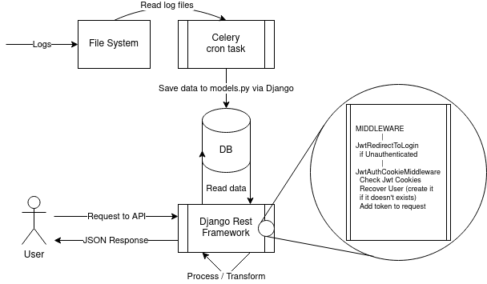

# Backend Documentation

## Dataflow and tasks

The data from a course is fetched from the filesystem using Celery cron tasks. This processes the logs and saves different metrics like sessions, course structure, etc to the Django DB.

Once a request arrives it passes through the middlewares and checks:
* Presence of the USE-JWT-COOKIE HTTP header.
* Both header-payload and sign cookies
* Recovers the JWT Token and decodes it
* Recovers the user from the JWT payload
* Goes to the particular view

Some views must check that the current user has permissions over the data. This is already checked client-side but acts as a failsafe to ensure the user has access only to the courses where it has some authority, i.e. a student shouldn't be able to asks for its peers information. This check is done by forwarding a request from the view, caching the response and checking permissions. 

NB: To send the request from a view we have to remove the recovered cookie.